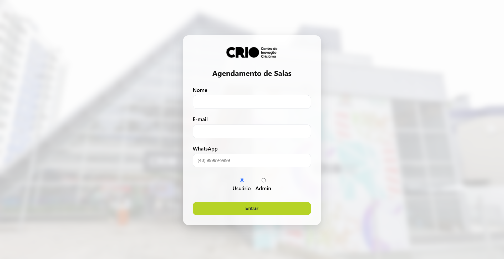
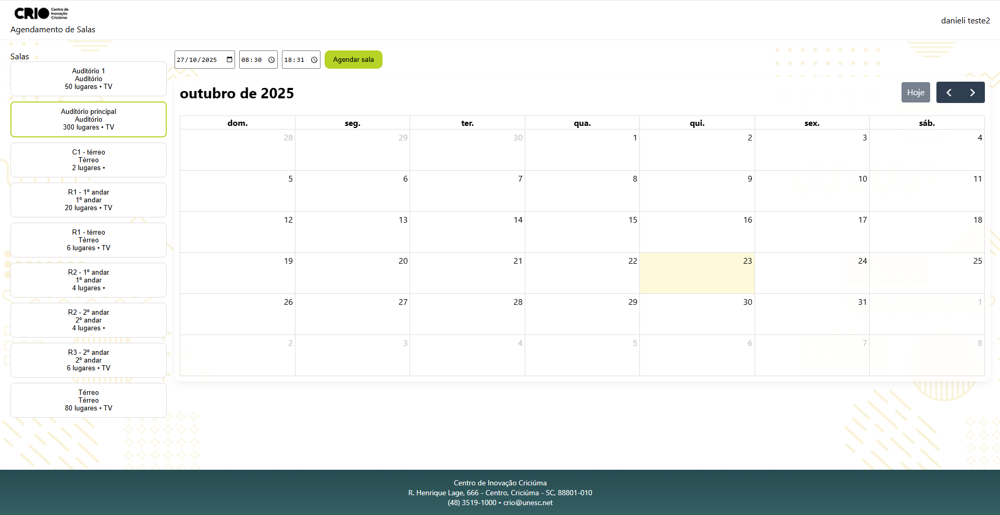

# 🏢 Agendamentos CRIO

Sistema de **agendamento de salas** desenvolvido para o **Centro de Inovação de Criciúma (CRIO)**, com interface moderna, responsiva e integração ao WhatsApp para confirmação de reservas.

---

## 🚀 Tecnologias Utilizadas

- **Frontend:** Next.js 14, React, FullCalendar  
- **Estilo:** CSS + Glass UI + Responsividade  
- **Backend:** Node.js + Express + Prisma  
- **Banco de Dados:** PostgreSQL  
- **Containerização:** Docker + Docker Compose  
- **Deploy local:** `http://localhost:3000`

---

## ⚙️ Como Rodar o Projeto

### 🔧 Pré-requisitos
- Node.js instalado  
- Docker e Docker Compose instalados  

### ▶️ Passos:

```bash
# Clone o repositório
git clone https://github.com/danielizeferino/agendamentos-crio.git

# Entre na pasta
cd agendamentos-crio

# Suba os containers (backend + frontend + banco)
docker compose up --build

---

## 🪟 Preview do Sistema

### 🔐 Tela de Login  
[](https://raw.githubusercontent.com/danielizeferino/agendamentos-crio/refs/heads/main/frontend/public/Captura%20de%20tela%202025-10-23%20132537.png)

### 📅 Tela de Agendamento  


---

## 👩‍💻 Funcionalidades Principais

- Login com nome, e-mail e WhatsApp obrigatório  
- Agendamento de salas com data e horário configuráveis  
- Modal de confirmação com resumo do agendamento  
- Notificação de reserva pendente via WhatsApp (Auditório Principal)  
- Exibição de todas as reservas para o perfil **Admin**  
- Layout responsivo e visual inspirado em **Glassmorphism**

---

## 🧠 Desenvolvido por
**Danieli Zeferino Mota**  
💼 Projeto acadêmico - UNESC / CRIO  


---

### ⭐ 
Se gostou do projeto, dá um **star** ⭐ no repositório pra apoiar o desenvolvimento! 😄
